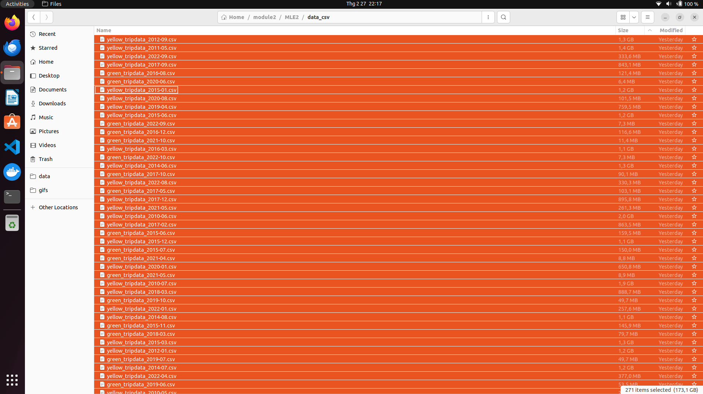
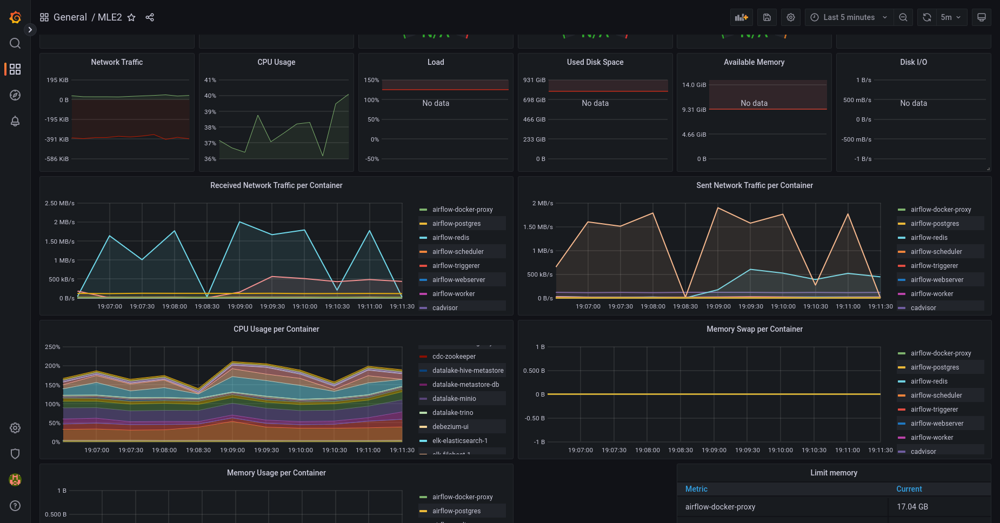
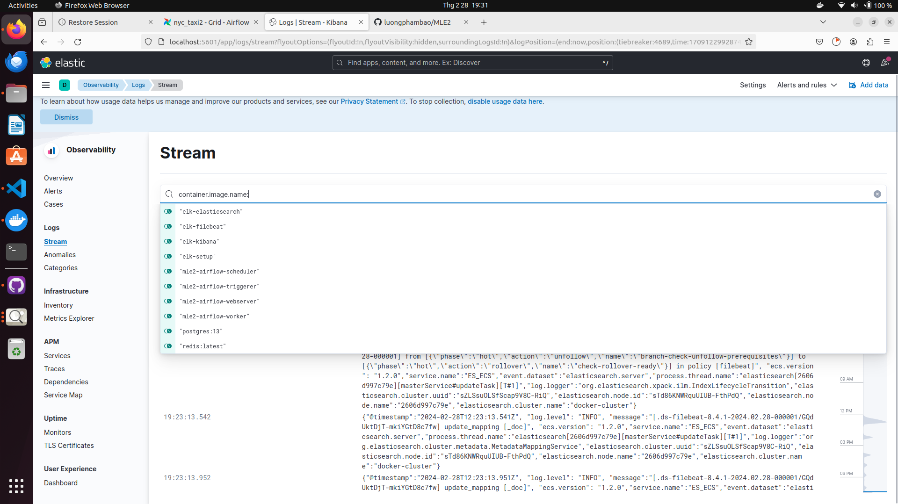
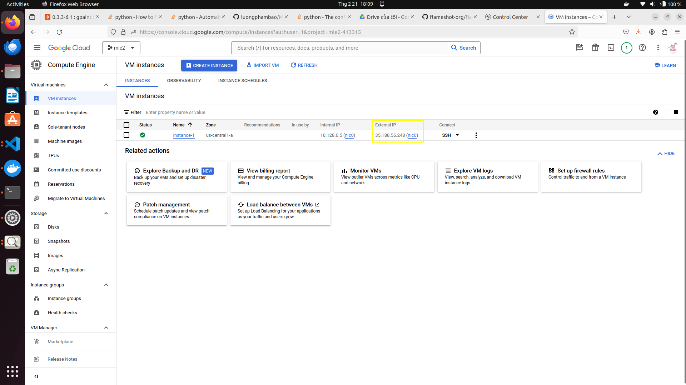
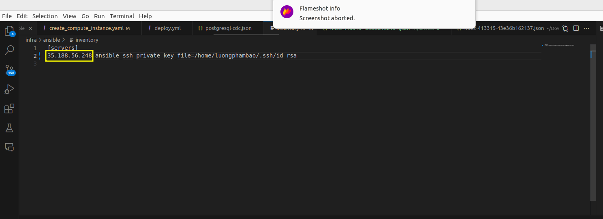
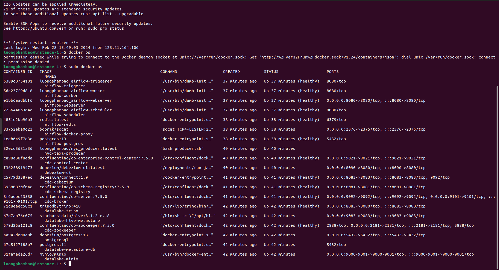

# MLE2
## **Description**: 

+ In this repository, there is a constructed data pipeline featuring distinct flows tailored for batch and streaming data processing. Different services are utilized to meet the specific needs of each flow. Pyspark, PostgreSQL, Flink, Kafka, DBT, and Airflow are prominent among the services employed for these purposes. Moreover, monitoring tools like Prometheus, Grafana, are integrated to ensure effective performance monitoring. 

## Overall data architecture


## Note:
+ **stream_processing** folder: contain streaming data source and streaming processing service (kafka for data source and flink for processing)
+ **jars** folder: contain used jars file for data pipeline (Pyspark)
+ **airflow** folder: contain airflow dag,configuration,and deployment
+ **utils** folder: helper funtions
+ **pyspark** folder: contain scripts for batch processing
+ **ansible** folder: contain ansible playbook for deploying data pipeline, monitoring tools, and airflow on Google Compute Engine
+ **monitoring** folder: contain configuration for monitoring tools (Prometheus, Grafana)
+ **data** folder: contain data raw and streaming data
+ **data-validation** folder: contain great_expectations for data validation
+ **dbt_nyc** folder: contain dbt project for data transformation nyctaxi data
+ **src** folder: contain source code for data pipeline
+ **This repo is implemented on 170GB nyc taxi data**


## 1. Installation
+ Tested on Python 3.9.12 (recommended to use a virtual environment such as Conda)
 ```bash
    conda create -n mle python=3.9
    pip install -r requirements.txt
 ```

+ Data: You can dowload and use this dataset in here: https://www.nyc.gov/site/tlc/about/tlc-trip-record-data.page. The format data I used in this Project is parquet/csv file

+ Docker engine
## How to guide 

You can use list command in `Makefile` to run service

For example: Run all service by command

 ```make run_all```
 ### Monitoring 
 Access at http://localhost:3000/ to for Grafana for tracking resource usage 
  
Access at http://localhost:5601/ to for Kibana for tracking logs
  
### Datalake-Minio
 You can see `datalake/README.MD` for details guide (setup,srcipts,...)
### Data Validation
 You can see `data-validation/README.MD` for details guide (setup,srcipts,...)
### Data Transformation DBT
  You can see `dbt_nyc/README.MD` for details guide (setup,srcipts,...)  
### Airflow
  You can see `airflow/README.MD` for details guide (setup,srcipts,...)
### Streamming Processing
+ You can see `stream_processing/README.MD` for details guide (setup,srcipts,...)
### Batch processing

+Pyspark helps efficiently handle big data, speeding up data reading and writing, and processing much faster as data grows.

+In this problem, we leverage Pyspark to transform and store data into a data warehouse, as well as quickly validate data.
#### How to guide

+ ``` python pyspark/batch_processing.py  #loading data from PostgreSQL```  
+ ``` python pyspark/spark_warehouse      #write data from datalake to warehouse```
+ ``` python pyspark/validation.py        #validation data ```


 
## Deploy data pipeline on Google Compute Engine
### Spin up your instance
Create your [service account](https://console.cloud.google.com/), and select [Compute Admin](https://cloud.google.com/compute/docs/access/iam#compute.admin) role (Full control of all Compute Engine resources) for your service account.

Create new key as json type for your service account. Download this json file and save it in `ansible/secrets` directory. Update your `project` and `service_account_file` in `ansible/create_compute_instance.yaml`.


Go back to your terminal, please execute the following commands to create the Compute Engine instance:
```bash
cd ansible
ansible-playbook create_compute_instance.yaml
```


Go to Settings, select [Metadata](https://console.cloud.google.com/compute/metadata) and add your SSH key.

Update the IP address of the newly created instance and the SSH key for connecting to the Compute Engine in the inventory file.


+ ```cd ansible```
+ To initialize a compute engine, json key file of service account on google cloud is located at **secrets folder**
+ ```ansible-playbook create_compute_instance.yaml``` to create virtual machine instance using ansible. Configuration of machine was defined in file create_compute_instance.yaml

    + Virtual machine is ready to run
    + Before moving to next step, subtitute **External IP** of created compute engine to **inventory file** in **ansible folder**
 
+ ```cd ansible/deploy_dataservice && ansible-playbook -i ../inventory deploy.yml``` to deploy data pipeline on cloud.
+ ```cd ansible/deploy_monitoring && ansible-playbook -i ../inventory deploy.yml``` to deploy monitoring tools on cloud.
+ You can see all data service and monitoring service on GCP 
 