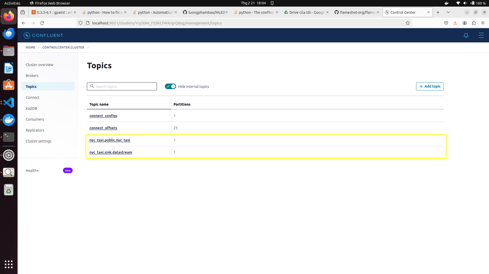

# MLE2
## **Description**: 

+ In this repository, there is a constructed data pipeline featuring distinct flows tailored for batch and streaming data processing. Different services are utilized to meet the specific needs of each flow. Pyspark, PostgreSQL, Flink, Kafka, DBT, and Airflow are prominent among the services employed for these purposes. Moreover, monitoring tools like Prometheus, Grafana, and LogStash are integrated to ensure effective performance tracking.

## Overall data architecture


## Note:
+ **stream_processing** folder: contain pyflink scripts to process streaming data
+ **jars** folder: contain used jars file for data pipeline 
+ **airflow** folder: enviroment to run airflow service
+ **utils** folder: helper funtions
+ **This repo is implemented on nyc taxi data**

## 1. Installation
+ Tested on Python 3.9.12 (recommended to use a virtual environment such as Conda)
 ```bash
    conda create -n mle python=3.9
    pip install -r requirements.txt
 ```

+ Data: You can dowload and use this dataset in here: https://www.nyc.gov/site/tlc/about/tlc-trip-record-data.page. The format data i use in this Project is Parquet file

+ Docker engine
## How to guide 

You can use list command in `Makefile` to run service

For example: Run all service by command

 ```bash
    make run_all
 ```
 ### Moniotring 
 Access at http://localhost:3000/ to for Grafana for tracking resource usage 
  
  
 ### Airflow


 You can see task in `airflow/dags` in  `data1.py` and `data2.py`

 ```bash
    make airflow_up
 ```

 Accesss at http://localhost:8080/ to for Airflow UI to run dag
 
 You create connection `postgre_default` 
 

 data1: Download data ->Create streamming data -> Transform data

 data2: Create Datawarehous->Insert data-> Check expectations

### 2.1. MinIO
+ MinIO is a datalake service
+ We can access MinIO console at port 9001 with user `minio_access_key` and password `minio_secret_key`

#### 2.1.1. Manual interaction
+ First, Select to **Buckets** and   choose **Create Bucket**

+ Name the bucket 

+ C lick to **Object Browser** and choose bucket had created on the console

+ Click **Upload** to upload any files or folders


#### 2.1.2. Automate interaction
+ Beside manual upload, we can use code to upload files or folder to MinIO
#### How to guide
+ You edit data_path and config in `utils/datalake.yaml`
+ ```python src/export_data_to_datalake.py```
+ All files needed to upload to MinIO will be executed
+ If you want to test query datalake you can create view ... 

### 2.3 Batch processing
+ Pyspark comes into plays when raw diabetes csv files needed to be preprocessed before feeding to models
+ Notice that some columns of dataset such as: Pregnancies, BloodPressure, SkinThickness, Insulin, Age have wide value ranges. Therefore, these columns needed to be scaled into 0 and 1, so min-max scaler is chosen 
#### How to guide

+ ```python pyspark/batch_processing.py``` 
+ ```pyspark/spark_insert.py```
+ ```pyspark/validation.py```
+ Processed data will be stored in PostgreSQL datawarehouse for later used

### 2.5. Streaming data source
+ Besides csv files data, there is also a streaming diabetes data
+ A new sample will be stored in a table in PostgreSQL
+ Then Debezium, which is a connector for PostgreSQL, will scan the table to check whenever the database has new data
+ The detected new sample will be push to the defined topic in Kafka
+ Any consumer can get messages from topic for any purposes
#### How to guide
+ ```cd postgresql_utils```
+ ```./run.sh register_connector ../configs/postgresql-cdc.json``` to send PostgreSQL config to Debezium

+ ```python create_table.py``` to create a new table on PostgreSQL
+ ```python insert_table.py``` to insert data to the table
+ We can access Kafka at port 9021 to check the results

+ Then click **Topics** bar to get all existing topics on Kafka

    + **dunghc.public.diabetes_new** is my created topic
+ Choose **Messages** to observe streaming messages


### 2.6. Streaming processing
+ To handle this streaming datasource, Pyflink is a good option to do this task
#### How to guide
+ ```cd stream_processing```
+ ```python datastream_api.py```
    + This script will check necessary key in messages as well as filter redundant keys and merge data for later use

        + Only information columns are kept
    + Processed samples will be stored back to Kafka in the defined sink

        + **dunghc.public.sink_diabetes** is the defined sink in my case
+ ```python kafka_consumer.py```
    + Messages from sink will be fed into diabetes service to get predictions
    + From then, New data is created
    + Notice, we have to validate predictions from the diabetes model to ensure labels are correct before using that data to train new models.