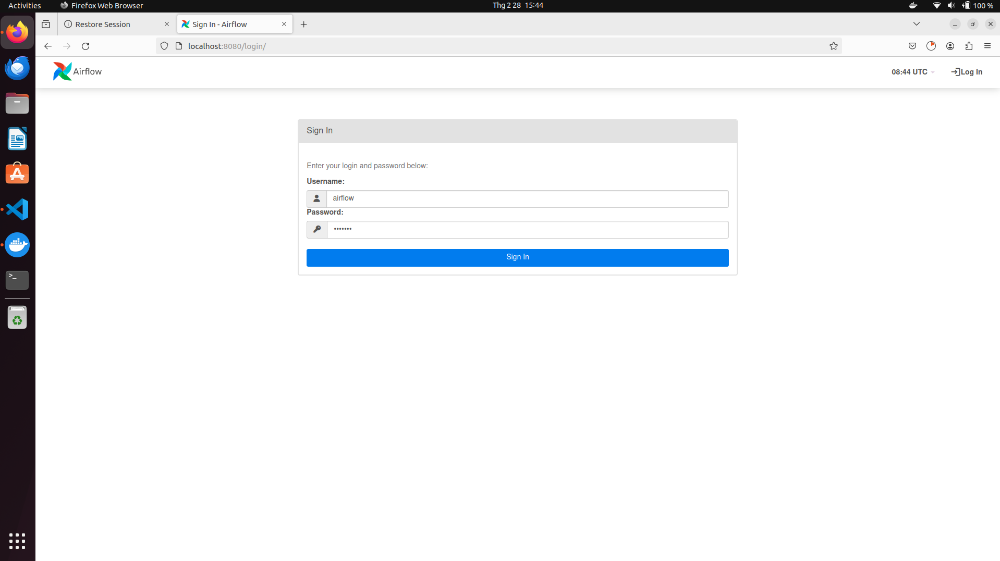
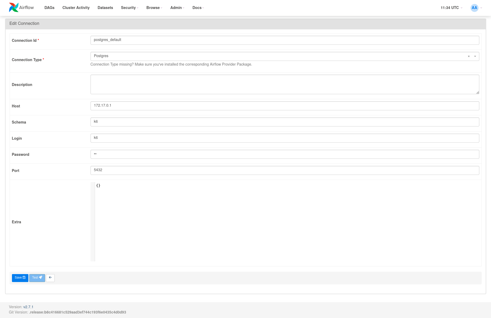
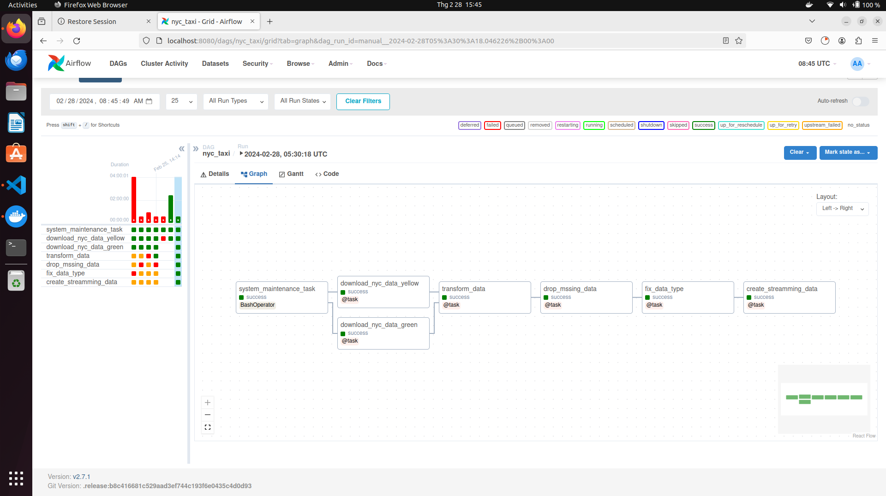
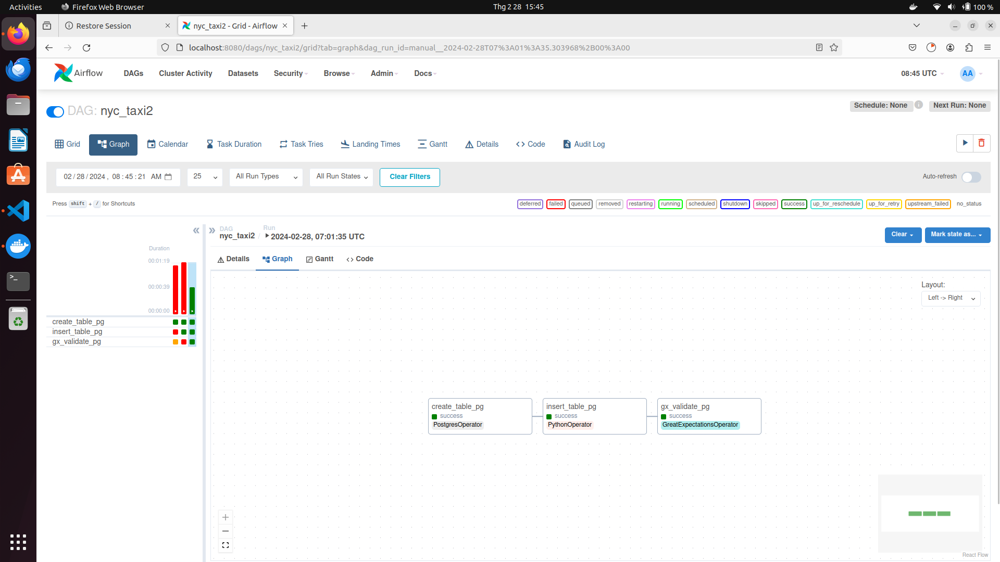
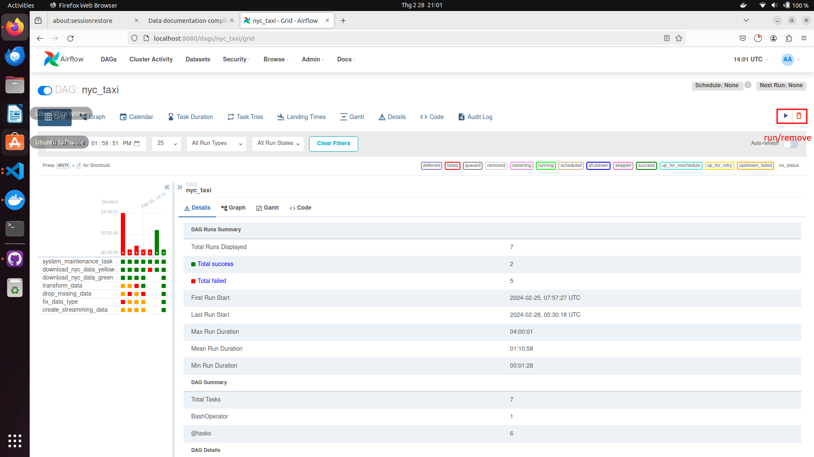

## Airflow

+ Airflow is a service to manage and schedule data pipeline
+ In this repo, airflow is run data pipeline (download data, transform data, insert data, check expectations,...)


Note: using commnad `sudo chmod 777 -R data` if error happen :))
### DAGs
```shell
.
├── nyc_pipeline.py: dag for NYC taxi data pipeline  ( download data, transform data,preprocess data)
├── data2warehouse.py: dag using Great Expectations to validate data and insert data into data warehouse
```
### Guide
+ To run Airflow, you can you following command ```make airflow up``` to run Airflow service( you can run ```make warehouse_up``` to start DB)
 Accesss at http://localhost:8080/ to for Airflow UI to run dag (login with username and password is `airflow`)
 
 You have to create connection `postgre_default` before running dag ```data2.py```
 

 You can see task in `airflow/dags` folder
 
 
  You can manual run dags by click on Run icon 
 
