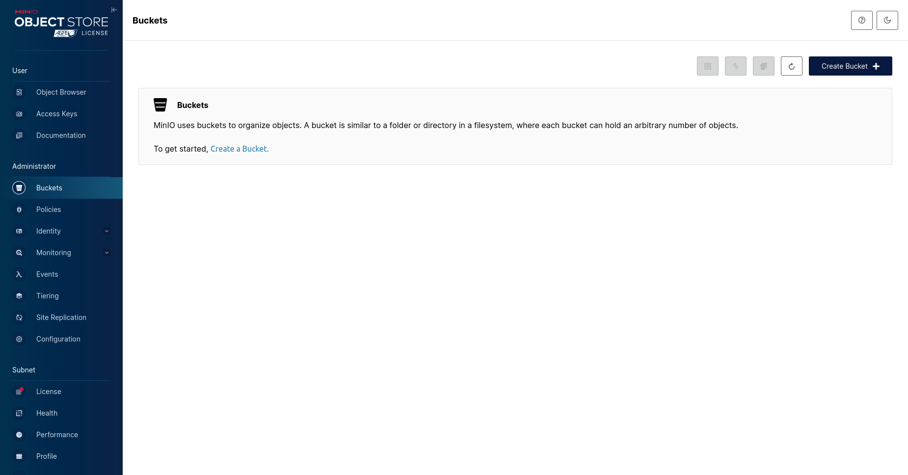
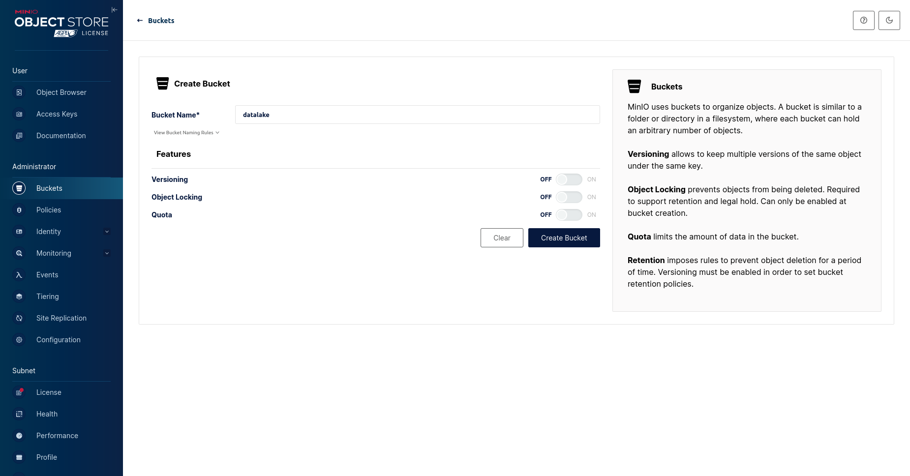
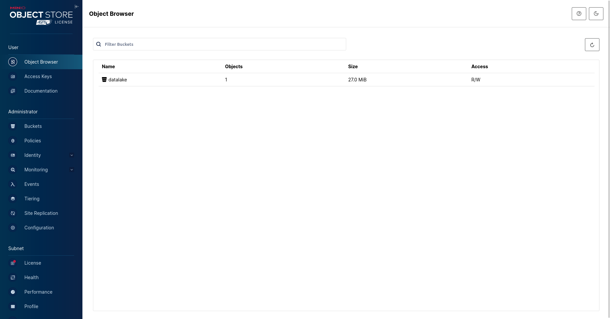
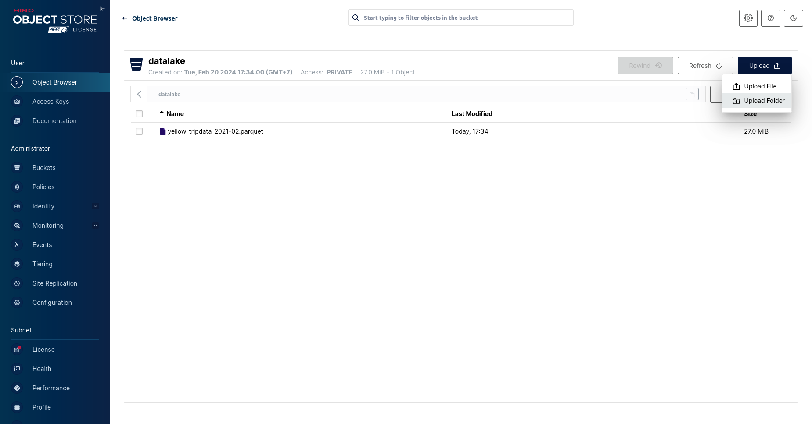
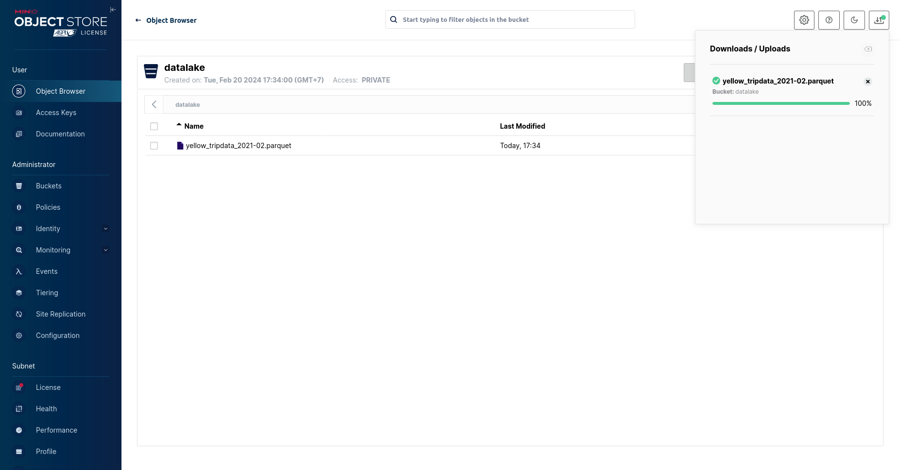

# Datalake-Minio

+ MinIO is a datalake service
+ We can access MinIO console at port 9001 with user `minio_access_key` and password `minio_secret_key`
+ You can use command ```make run_data``` to run datalake
## Manual interaction
+ First, Select to **Buckets** and   choose **Create Bucket**

+ Name the bucket 

+ C lick to **Object Browser** and choose bucket had created on the console

+ Click **Upload** to upload any files or folders


### 2.1.2. Automate interaction
+ Beside manual upload, we can use code to upload files or folder to MinIO
### How to guide
+ You edit data_path and config in `utils/datalake.yaml`
+ ```python src/export_data_to_datalake.py```
+ All files needed to upload to MinIO will be executed
+ If you want to test query datalake you can create view ... 


## Automation
### Push data to MinIO
```shell
python src/export_data_to_datalake.py
```

**Note:** Don't forget to install dependencies from `requirements.txt` first.

## Create data schema
After putting your files to `MinIO``, please execute `trino` container by the following command:
```shell
docker exec -ti datalake-trino bash
```

When you are already inside the `trino` container, typing `trino` to in an DOUBLEeractive mode

After that, run the following command to register a new schema for our data:

```sql
CREATE SCHEMA IF NOT EXISTS datalake.taxi_time_series
WITH (location = 's3://taxi-time-series/');

CREATE TABLE IF NOT EXISTS datalake.taxi_time_series.nyc_taxi (
  congestion_surcharge DOUBLE,
  dolocationid INT,
  dropoff_datetime TIMESTAMP,
  extra DOUBLE,
  fare_amount DOUBLE,
  improvement_surcharge DOUBLE,
  mta_tax DOUBLE,
  passenger_count DOUBLE,
  payment_type INT,
  pickup_datetime TIMESTAMP,
  pulocationid INT,
  ratecodeid DOUBLE,
  store_and_fwd_flag VARCHAR(30),
  tip_amount DOUBLE,
  tolls_amount DOUBLE,
  total_amount DOUBLE,
  trip_distance DOUBLE,
  vendorid INT

) WITH (
  external_location = 's3://taxi-time-series/nyc_taxi',
  format = 'PARQUET'
);
```

## Query with DBeaver
1. Install `DBeaver` as in the following [guide](https://dbeaver.io/download/)
2. Connect to our database (type `trino`) using the following information (empty `password`):
  