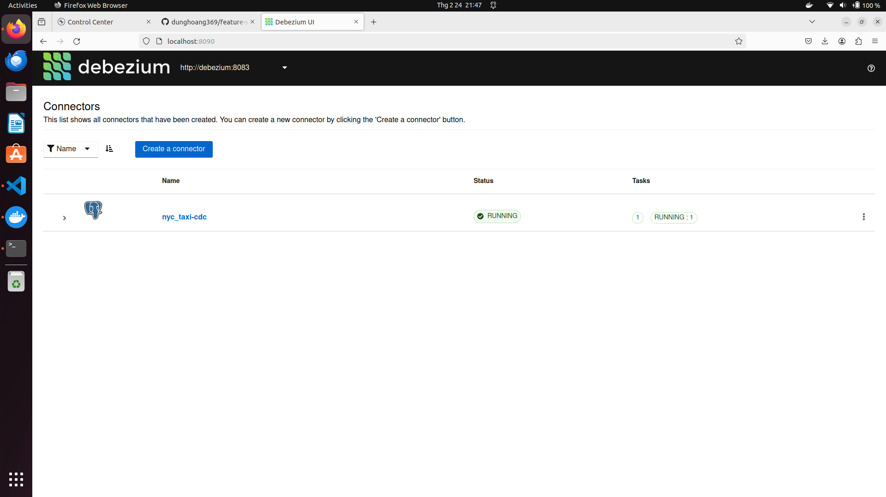
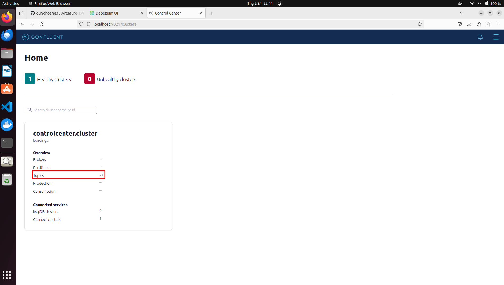
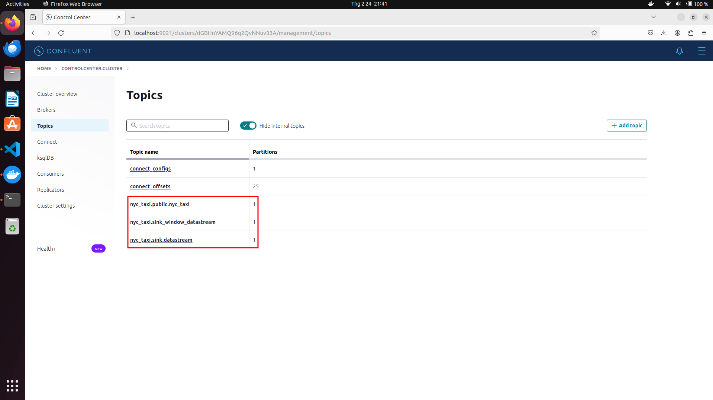
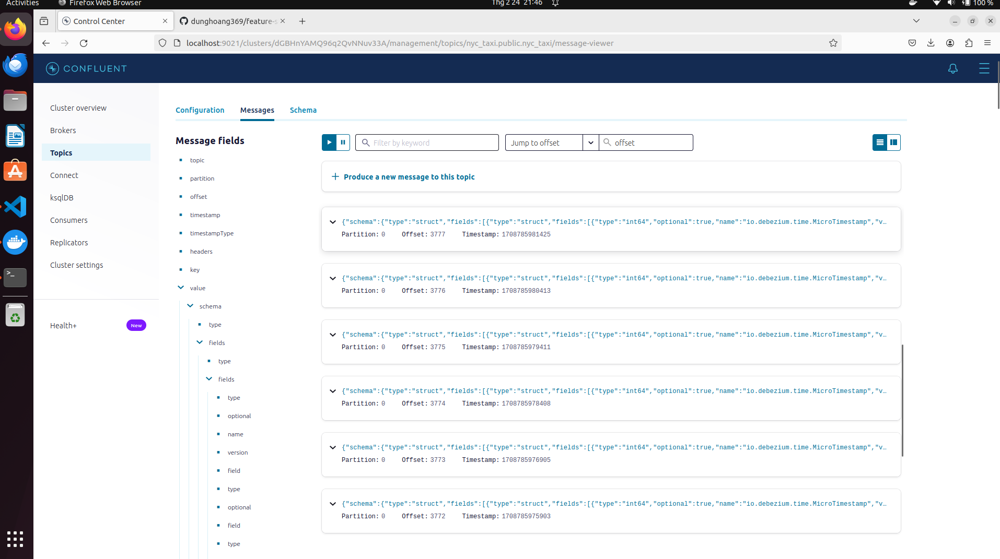

## Streamming data
+ Streaming data is a data that is continuously generated by thousands of data sources, which typically send the data records in small sizes.
+ In this project, we use Kafka as a streaming data source and Pyflink to handle this streaming data
+ The data is generated from the nyc taxi data in the datalake( you can get data from ```data/stream/stream.parquet```)
### Streaming data source
+ Nyc taxi streaming data is generated based on data from datalake
+ Each newly created data sample is stored in a table in PostgreSQL
+ Debezium then acts as a connector with PostgreSQL and will scan the table to check if the database has newly updated data.
+ Newly created data will be pushed to corresponding topics in kafka
+ Any consumer can receive messages from the topic to which the consumer subscribes
#### How to guide
First, we change directory to `stream_processing/kafka``
+ ```bash run.sh register_connector configs/postgresql-cdc.json```to send PostgreSQL config to Debezium

+ ```python create_table.py``` to create a new table on PostgreSQL
+ ```python insert_table.py``` to insert data to the table
+ We can access Kafka at port 9021 to check the results

+ Then click **Topics** bar to get all existing topics on Kafka

    + **nyc_taxi.public.nyc_taxi** is my created topic
+ Choose **Messages** to observe streaming messages

+ Finally, you can create kafka service for streaming data
``` 
cd stream_processing/kafka
docker build -t nyc_producer:latest .
docker image tag nyc_producer:latest ${name}/nyc_producer:latest
docker push ${name}/nyc_producer:latest #name is your docker hub name
```
### Streaming processing
+ To handle this streaming datasource, Pyflink or Kafka can be used, but in this project, we use Pyflink to process the data
#### How to guide
+ ```cd stream_processing/scripts```
+ ```python datastream_api.py && python window_datastream_api.py```
    + These scripts will extract the necessary information fields in the message and aggregate the data to serve many purposes
    + Processed data samples will be stored in kafka in the specified sink

        + **nyc_taxi.sink.datastream** and **nyc_taxi.sink_window.datastream** is the defined sink and window sink in my case
+ ```python kafka_consumer.py```
    + Messages from topic  will be stored and used for further processing(analyse, visualize,cost prediction,...)
